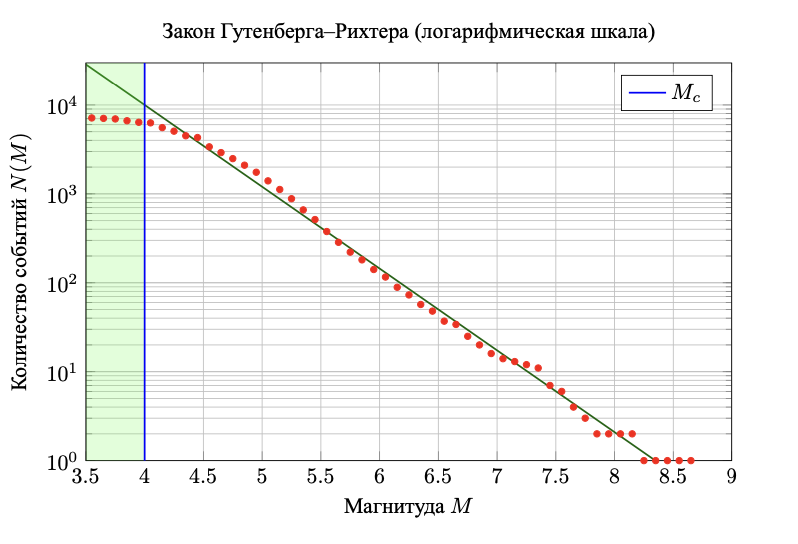
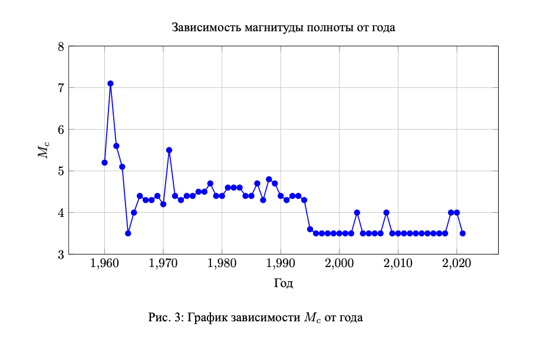

# Влияение ядерных взрывов на динамику **a** и **b**-значений в законе Гутенберга–Рихтера

## Описание

Этот проект направлен на исследование влияния подземных ядерных взрывов на динамику параметров закона Гутенберга–Рихтера, а именно на параметры **a** и **b**. Оценка коэффициентов и магнитуды полноты (**Mc**) осуществляется с использованием метода робастной подгонки (RFM), что позволяет обеспечить устойчивость результатов к выбросам и неоднородности исходных данных.

Для анализа структурных изменений, вызванных ядерными взрывами, применяется **критерий Чоу**, который позволяет статистически проверить наличие разрывов в параметрах линейной модели. В результате был выявлен статистически значимый структурный сдвиг в данных на интервале с 1988 по 1995 год. Оценки регрессионных зависимостей показали различие как в среднем уровне, так и в темпе изменения параметров **a** и **b** до и после выявленной точки разрыва.

## Структура проекта

1. **`loader.py`** — скрипт для загрузки сейсмических данных с официального сайта ISC (International Seismological Centre).
   
2. **`postgres.py`** — скрипт для загрузки данных в базу данных PostGIS для дальнейшего анализа.
   
3. **`RFM.py`** — модуль, который рассчитывает значения **Mc**, **a** и **b** по годам с использованием робастной подгонки.
   
4. **`lines.py`** — код для анализа структурных изменений с помощью критерия Чоу, поиска оптимального года разрыва, а также визуализации данных.

